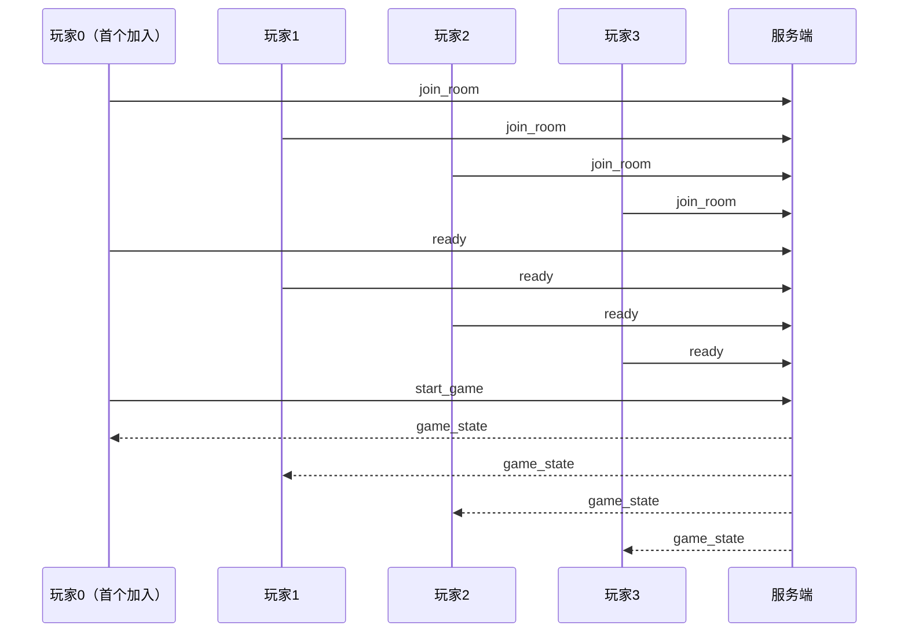

# 联机参与指南

本文说明如何加入 skill-mahjong 的 WebSocket 联机对局。

> **当前状态**：服务端与协议已实现，游戏内「联机大厅」UI 尚未接入。  
> 现阶段需通过 WebSocket 客户端手动发送 JSON 消息参与对局。

---

## 前置条件

- 项目已安装依赖：`npm install`
- Node.js 18+

---

## 1. 启动服务端

在**主机**（负责跑游戏逻辑的机器）上执行：

```bash
cd skill-mahjong
npm run server
```

成功后会看到：

```text
[skill-mahjong] WebSocket server ws://localhost:3001
```

默认端口为 `3001`，可通过环境变量修改：

```bash
PORT=8080 npm run server
```

---

## 2. 连接地址

| 场景 | WebSocket 地址 |
|------|----------------|
| 同一台电脑测试 4 人 | `ws://localhost:3001` |
| 同一 WiFi / 局域网 | `ws://<主机局域网 IP>:3001` |
| 公网联机 | 部署到云服务器后，使用 `ws://<公网 IP或域名>:3001` |

### 查看主机局域网 IP（macOS）

```bash
ipconfig getifaddr en0
```

### 查看主机局域网 IP（Windows）

```cmd
ipconfig
```

其他玩家在同一网络下，将 `<主机局域网 IP>` 替换为上述命令得到的地址即可。

---

## 3. 加入对局流程

每个玩家独立连接 WebSocket，**四人必须使用相同的 `roomId`**。



### 步骤 1：加入房间

```json
{"type":"join_room","roomId":"room1","name":"小明"}
```

| 字段 | 说明 |
|------|------|
| `roomId` | 房间号，四人必须一致 |
| `name` | 昵称，用于大厅显示 |

服务端回复：

```json
{"type":"joined","roomId":"room1","playerIndex":0}
```

`playerIndex` 为座位号 `0–3`（0 为首个加入者，即东风位）。

同时会收到 `room_state`，显示各座位在线 / 准备状态。

### 步骤 2：准备

```json
{"type":"ready"}
```

四人全部 ready 后，**仅 0 号位玩家**可发起开局。

### 步骤 3：开始游戏

```json
{"type":"start_game"}
```

仅 **playerIndex === 0** 的玩家可发送。成功后每人收到 `game_state`。

### 步骤 4：对局操作

| 消息 | 何时发送 | 示例 |
|------|----------|------|
| 出牌 | `phase === "discard"` 且轮到自己 | `{"type":"discard","tileId":"tile_57"}` |
| 过 | 响应阶段，不想吃碰杠胡 | `{"type":"pass"}` |
| 吃碰杠胡 | 响应阶段，有可执行选项 | 见下文 |

**吃**（需指定手牌中两张牌的 id）：

```json
{"type":"respond","action":"chi","chiTileIds":["tile_12","tile_13"]}
```

**碰 / 杠 / 胡**：

```json
{"type":"respond","action":"pong"}
{"type":"respond","action":"kong"}
{"type":"respond","action":"hu"}
```

摸牌由服务端在 `draw` 阶段**自动执行**（约 400ms 后），无需手动发送摸牌消息。

---

## 4. 服务端推送消息

### `room_state` — 大厅状态

```json
{
  "type": "room_state",
  "state": {
    "roomId": "room1",
    "inGame": false,
    "seats": [
      { "playerIndex": 0, "name": "小明", "connected": true, "ready": true },
      { "playerIndex": 1, "name": "小红", "connected": true, "ready": true }
    ]
  }
}
```

### `game_state` — 对局状态（按玩家视角隐藏信息）

```json
{
  "type": "game_state",
  "state": {
    "view": { "viewer": 0, "phase": "discard", "deckCount": 80, "..." : "..." },
    "lastDrawnTileId": "tile_99"
  }
}
```

- **己方手牌**：`players[viewer].hand.kind === "visible"`，含完整 `tiles`
- **他人手牌**：`kind === "hidden"`，仅 `count`
- **牌墙**：不发送明细，只有 `deckCount`
- **lastDrawnTileId**：仅刚摸牌的玩家会收到，用于 UI 高亮

### `error` — 错误

```json
{"type":"error","message":"不是你的回合"}
```

---

## 5. 参与方式示例

### 方式 A：浏览器开发者工具

1. 打开任意网页，按 F12 打开控制台
2. 粘贴并执行：

```javascript
const ws = new WebSocket('ws://localhost:3001');

ws.onmessage = (e) => {
  const msg = JSON.parse(e.data);
  console.log('←', msg);
};

ws.onopen = () => {
  ws.send(JSON.stringify({ type: 'join_room', roomId: 'room1', name: '玩家A' }));
};

// 收到 joined 后，在控制台执行：
// ws.send(JSON.stringify({ type: 'ready' }));

// 四人 ready 后，0 号位执行：
// ws.send(JSON.stringify({ type: 'start_game' }));

// 出牌示例（tileId 从 game_state.view 中己方手牌获取）：
// ws.send(JSON.stringify({ type: 'discard', tileId: 'tile_57' }));
```

3. 开 **4 个浏览器窗口**，分别作为 4 名玩家重复上述步骤

### 方式 B：wscat

安装：

```bash
npm install -g wscat
```

连接：

```bash
wscat -c ws://localhost:3001
```

连接成功后输入 JSON（一行一条）：

```text
> {"type":"join_room","roomId":"room1","name":"玩家B"}
> {"type":"ready"}
```

---

## 6. 座位与方位

| playerIndex | 方位 | 说明 |
|-------------|------|------|
| 0 | 东 | 首个加入房间的玩家；默认庄家；负责 `start_game` |
| 1 | 南 | |
| 2 | 西 | |
| 3 | 北 | |

---

## 7. 常见问题

### 房间已满

四人已加入后再 `join_room` 会收到：

```json
{"type":"error","message":"房间已满"}
```

请换 `roomId` 或等待有人离开。

### 无法开局

- 是否已有 4 人加入？
- 是否四人都已 `ready`？
- 是否由 **0 号位** 发送 `start_game`？

### 局域网连不上

- 确认主机防火墙允许 `3001` 端口入站
- 确认客户端使用的是主机**局域网 IP**，不是 `localhost`（除非在同一台机器上）

### 看不到他人手牌

这是预期行为。联机使用 `PlayerView`，他人手牌仅显示张数，防止作弊。

---

## 8. 相关代码

| 路径 | 说明 |
|------|------|
| `src/server/index.ts` | WebSocket 服务入口 |
| `src/server/Room.ts` | 房间与对局逻辑 |
| `src/shared/protocol.ts` | 消息类型定义 |
| `src/core/playerView.ts` | 联机视角快照（信息隐藏） |
| `src/core/MahjongGame.ts` | `getSnapshotForPlayer()` |

---

## 9. 后续计划

- [ ] 客户端 `useOnlineGame` hook
- [ ] 联机大厅 UI（房间号、昵称、准备、开局）
- [ ] 现有牌桌 UI 接入 `PlayerView`

完成后，玩家将无需手动发送 JSON，打开网页即可联机。
